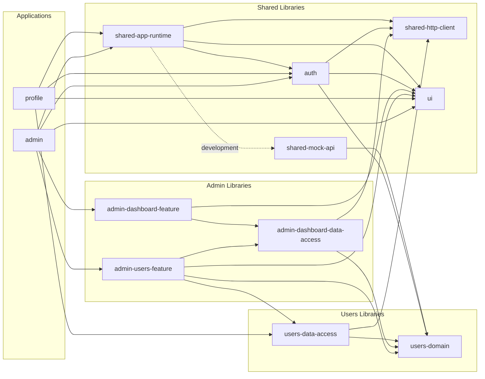
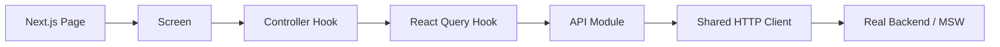

# پلتفرم SaaS — معماری Frontend چندمحصولی

این پروژه یک Frontend چندمحصولی برای یک پلتفرم SaaS است که دو محصول مستقل **Admin** و **Profile** را در یک Monorepo نگه‌داری می‌کند. هدف اصلی پروژه نمایش یک معماری قابل توسعه برای چند محصول و چند تیم است؛ بنابراین تصمیم‌ها بیشتر بر مرزبندی کد، مالکیت Featureها، مدیریت وابستگی‌ها و رفتار قابل پیش‌بینی برنامه متمرکز هستند.

## فهرست مطالب

- [قابلیت‌های پیاده‌سازی‌شده](#features)
- [اجرای پروژه](#getting-started)
- [معماری انتخاب‌شده](#architecture)
- [ساختار مخزن](#repository-structure)
- [پروژه‌ها و Libraryهای Nx](#nx-projects)
- [گراف وابستگی Nx](#dependency-graph)
- [مرز مسئولیت لایه‌ها](#layers)
- [تصمیم متفاوت برای Admin و Profile](#admin-profile-strategy)
- [مدیریت API و Server State](#server-state)
- [احراز هویت و Protected Routes](#authentication)
- [مدیریت Loading و Error](#async-states)
- [دلیل انتخاب تکنولوژی‌ها](#technology-decisions)
- [توسعه پروژه با Featureها و تیم‌های جدید](#scaling)
- [کنترل کیفیت](#quality)

<a id="features"></a>

## قابلیت‌های پیاده‌سازی‌شده

### Admin

- ورود و خروج کاربر
- محافظت از تمام Routeهای مدیریتی و کنترل نقش `admin`
- Dashboard با خلاصه تعداد کاربران و مدیران
- مشاهده فهرست کاربران
- مشاهده جزئیات کاربر
- ساخت، ویرایش و حذف کاربر
- فرم‌های Formik با Validation مبتنی بر Yup
- Sidebar واکنش‌گرا و رابط کاملاً راست‌چین

### Profile

- ورود و خروج کاربر
- محافظت از Route پروفایل
- دریافت و نمایش اطلاعات کاربر واردشده
- رابط کاملاً راست‌چین

### قابلیت‌های مشترک

- احراز هویت و بررسی اعتبار Session
- HTTP Client و قرارداد یکسان برای خطاهای API
- مدیریت Server State با React Query
- Theme، Layout، حالت‌های Loading/Error و زیرساخت RTL
- API Mock با MSW و داده‌ها و پیام‌های فارسی
- جلوگیری از ارسال تکراری عملیات در زمان Loading

<a id="getting-started"></a>

## اجرای پروژه

### پیش‌نیاز

- نسخه LTS از Node.js
- npm

### نصب

```bash
npm install
```

فایل‌های Service Worker مربوط به MSW داخل هر دو اپ قرار دارند. اگر این فایل‌ها حذف شدند، می‌توان آن‌ها را دوباره ساخت:

```bash
npx msw init apps/admin/public --save
npx msw init apps/profile/public --save
```

### اجرای اپ‌ها

```bash
# Admin: http://localhost:3000
npm run dev:admin

# Profile: http://localhost:3001
npm run dev:profile
```

### حساب‌های آزمایشی

| کاربرد | ایمیل           | رمز عبور   |
| ------ | --------------- | ---------- |
| مدیر   | `admin@saas.io` | `admin123` |
| کاربر  | `user@saas.io`  | `user123`  |

برای ورود به Routeهای محافظت‌شده Admin باید از حساب مدیر استفاده شود.

Mock API در محیط Development به‌صورت خودکار فعال است. برای فعال‌کردن صریح آن در محیطی دیگر می‌توان مقدار زیر را تنظیم کرد:

```bash
NEXT_PUBLIC_ENABLE_MOCKS=true
```

در Production و بدون این متغیر، برنامه درخواست‌ها را به Endpointهای واقعی `/api` ارسال می‌کند.

<a id="architecture"></a>

## معماری انتخاب‌شده

معماری پروژه یک **Modular Monorepo با Feature-based Architecture و مرزبندی لایه‌ای** است.

- **Monorepo** امکان نگه‌داری چند محصول و کد مشترک آن‌ها را در یک مخزن فراهم می‌کند.
- **Feature-based Architecture** کد را بر اساس قابلیت‌های کسب‌وکار مانند Authentication، User Management و Dashboard سازماندهی می‌کند.
- **Layered boundaries** جهت وابستگی میان Domain، Data Access، Feature، UI و App را مشخص می‌کند.
- هر Next.js App یک واحد مستقل برای اجرا، Build و استقرار است و نقش Composition Root محصول را دارد.

این ساختار برای سناریوی تسک مناسب است، چون تغییر مشترک در Auth، UI یا API می‌تواند به‌صورت Atomic برای هر دو محصول انجام شود؛ در عین حال کد اختصاصی هر محصول و مالکیت تیم‌ها از یکدیگر جدا می‌ماند.

Micro Frontend در وضعیت فعلی انتخاب نشده است. دو Next.js App از نظر اجرا و استقرار مستقل هستند و نیاز فعلی به ترکیب چند Frontend در Runtime وجود ندارد. اضافه‌کردن Micro Frontend در این مرحله هزینه Versioning، ارتباط Runtime، استقرار و Debug را بالا می‌برد، بدون آنکه مسئله‌ای واقعی را حل کند. مرزهای فعلی اجازه می‌دهند در صورت ایجاد نیاز سازمانی واقعی، این تصمیم بعداً بازنگری شود.

<a id="repository-structure"></a>

## ساختار مخزن

```text
.
├── apps/
│   ├── admin/
│   │   ├── app/                         # Next.js routes, layouts, loading و error boundaries
│   │   │   ├── login/
│   │   │   └── (protected)/
│   │   │       ├── dashboard/
│   │   │       └── users/
│   │   │           ├── new/
│   │   │           └── [id]/edit/
│   │   └── src/app-shell/               # Navigation و تنظیمات Shell اپ Admin
│   │
│   └── profile/
│       ├── app/                         # Next.js routes و layouts
│       │   ├── login/
│       │   └── (protected)/profile/
│       └── src/
│           ├── app-shell/               # تنظیمات Shell اپ Profile
│           └── features/profile/        # Feature داخلی و اختصاصی Profile
│
├── libs/
│   ├── admin/
│   │   ├── dashboard/
│   │   │   ├── feature/                 # Dashboard screen
│   │   │   └── data-access/             # Query، query key و API
│   │   └── users/feature/               # Feature کامل User Management در Admin
│   │       └── src/
│   │           ├── screens/              # ورودی‌های سطح Route
│   │           ├── components/           # اجزای نمایشی Feature
│   │           ├── hooks/                # منطق و Controllerهای صفحه
│   │           └── validation/           # Schemaهای Yup
│   │
│   ├── users/
│   │   ├── domain/                      # مدل‌ها و قراردادهای مستقل از Framework
│   │   └── data-access/                 # React Query hooks و Users API
│   │
│   ├── auth/                            # Login، Session، Logout و ProtectedRoute
│   ├── ui/                              # UI و Layout مشترک و مستقل از محصول
│   └── shared/
│       ├── app-runtime/                 # Providerهای سراسری و QueryClient
│       ├── http-client/                 # تنها محل استفاده مستقیم از fetch
│       └── mock-api/                    # Handlerها و داده‌های MSW
│
├── tools/                               # تنظیمات مشترک alias و Next.js
├── eslint.config.mjs                    # قوانین کیفیت و Nx boundaries
├── nx.json
├── tsconfig.base.json                   # Public import aliases
└── vitest.config.mjs
```

<a id="nx-projects"></a>

## پروژه‌ها و Libraryهای Nx

Workspace در حال حاضر **۱۲ پروژه Nx** دارد: **۲ Application** و **۱۰ Library**.

| محدوده      |  تعداد | پروژه‌ها                                                                        |
| ----------- | -----: | ------------------------------------------------------------------------------- |
| Application |      ۲ | `admin`, `profile`                                                              |
| Admin       |      ۳ | `admin-users-feature`, `admin-dashboard-feature`, `admin-dashboard-data-access` |
| Users       |      ۲ | `users-domain`, `users-data-access`                                             |
| Shared      |      ۵ | `auth`, `ui`, `shared-app-runtime`, `shared-http-client`, `shared-mock-api`     |
| **مجموع**   | **۱۲** | **۲ App + ۱۰ Library**                                                          |

Libraryها فقط برای اشتراک کد ساخته نشده‌اند. در Admin، بعضی Libraryها مرز مالکیت، نوع وابستگی و واحد مستقل Cache/Affected در Nx نیز هستند. در مقابل، کوچک‌ترین فایل یا Feature به Library تبدیل نشده تا گراف پروژه بی‌دلیل بزرگ و نگه‌داری آن پرهزینه نشود.

<a id="dependency-graph"></a>

## گراف وابستگی Nx

نمودار زیر از خروجی واقعی `nx graph` این Workspace استخراج شده است. جهت فلش از مصرف‌کننده به وابستگی است و خط‌چین وابستگی Dynamic مربوط به بارگذاری MSW را نشان می‌دهد.



برای مشاهده نسخه Interactive گراف:

```bash
npx nx graph
```

وابستگی `admin-users-feature` به `admin-dashboard-data-access` برای باطل‌کردن Cache خلاصه Dashboard پس از حذف کاربر است. اگر تعداد Featureهای Admin زیاد شود، این هماهنگی می‌تواند به یک لایه Invalidation/Event مشترک منتقل شود تا Featureها به یکدیگر وابستگی مستقیم نداشته باشند.

<a id="layers"></a>

## مرز مسئولیت لایه‌ها

### Apps؛ Composition Root و Routing

پوشه‌های `apps/*/app` فقط مسئول موارد زیر هستند:

- تعریف URL و Route با Next.js App Router
- Layout و Error/Loading boundary سطح Route
- Metadata و Redirect ورودی اپ
- اتصال Route به Screen یا Feature مناسب

کد فرم، Query، مدیریت State و جزئیات UI داخل `page.tsx` قرار نمی‌گیرد. این تصمیم Routeها را کوتاه و قابل فهم نگه می‌دارد، وابستگی کد کسب‌وکار به Next.js را کم می‌کند و جابه‌جایی یا تست Feature را ساده‌تر می‌سازد.

### Screen

Screen ورودی UI یک قابلیت در سطح Route است. وظیفه آن چیدن Componentها و نمایش حالت‌های اصلی صفحه مانند Loading، Error، Empty و Success است. Route فقط Screen را از Public API مربوط به Feature وارد می‌کند.

### Component

Componentهای داخل Feature بخش‌های نمایشی مانند جدول کاربران، فرم، کارت جزئیات و Dialog حذف هستند. ورودی و رخدادها تا حد ممکن با Props دریافت می‌شوند. این تفکیک باعث می‌شود UI خواناتر، قابل استفاده مجدد و مستقل از جزئیات Navigation یا Data Fetching باشد.

### Controller Hook

در Screenهایی که مدیریت Query، Mutation، Router، Toast، Dialog یا جلوگیری از کلیک تکراری پیچیده شده، این منطق به Custom Hook منتقل شده است. برای مثال `useUsersListController` وضعیت فهرست، حذف، Toast، Navigation و Cache invalidation را مدیریت می‌کند و `UsersListScreen` روی نمایش تمرکز دارد.

هدف این نیست که هر Screen بدون توجه به اندازه آن حتماً یک Hook داشته باشد. استخراج منطق زمانی انجام می‌شود که خوانایی، تست‌پذیری یا استفاده مجدد را بهتر کند؛ Screen ساده Profile عمداً مستقیم و کوچک باقی مانده است.

### Data Access و API

Data Access شامل React Query hooks، Query Keyها، Mutationها و API Moduleهای یک Domain است. API Module فقط Endpoint، Method، Payload و نوع پاسخ را می‌شناسد و هیچ تصمیم نمایشی نمی‌گیرد.

این مرزبندی اجازه می‌دهد Backend واقعی، Mock API، سیاست Cache یا کتابخانه انتقال HTTP بدون بازنویسی Screenها تغییر کند.

### Domain

`users-domain` شامل مدل‌های `User`، `UserRole` و ورودی‌های مربوط به کاربر است. این لایه به React، Next.js، MUI یا React Query وابسته نیست. مستقل‌بودن Domain از Framework از انتشار وابستگی‌های UI و Data Fetching به مدل‌های اصلی جلوگیری می‌کند.

### Public API

هر Library یک `src/index.ts` دارد. مصرف‌کننده‌ها از Aliasهایی مانند موارد زیر استفاده می‌کنند:

```ts
import { UsersListScreen } from "@saas/admin/users/feature";
import { useUser } from "@saas/users/data-access";
```

فایل‌های داخلی Feature مستقیماً Deep Import نمی‌شوند. Public API سطح قابل پشتیبانی Library را مشخص می‌کند، Refactor داخلی را کم‌هزینه‌تر می‌سازد و از وابستگی به جزئیات پیاده‌سازی جلوگیری می‌کند.

<a id="admin-profile-strategy"></a>

## تصمیم متفاوت برای Admin و Profile

اندازه، نرخ رشد و مدل مالکیت دو محصول یکسان فرض نشده است؛ به همین دلیل Granularity پروژه‌های Nx در آن‌ها عمداً متفاوت است.

### Profile

Profile فعلاً یک قابلیت کوچک و منسجم دارد و فرض شده در آینده یک تیم مالک کل این محصول باشد. Feature پروفایل در مسیر زیر قرار گرفته است:

```text
apps/profile/src/features/profile/profile-screen.tsx
```

تبدیل این Feature کوچک به یک Nx Library مستقل، در حال حاضر مزیت مرزبندی تیمی قابل توجهی ایجاد نمی‌کند و فقط Node، تنظیمات و مسیر دیگری به Project Graph اضافه می‌کند. نزدیک‌بودن Feature به اپ، پیدا کردن کد و تغییرات یک تیم واحد را ساده نگه می‌دارد.

### Admin

Admin بزرگ‌تر فرض شده و احتمال دارد یک یا چند تیم به‌صورت هم‌زمان روی User Management، Dashboard و Featureهای آینده کار کنند. Featureهای Admin به Libraryهای Nx تبدیل شده‌اند تا:

- مرز مالکیت هر Feature روشن باشد؛
- وابستگی‌های غیرمجاز با Tag و ESLint متوقف شوند؛
- Nx بتواند تغییرات اثرپذیر را دقیق‌تر تشخیص دهد؛
- Cache و اجرای Taskها با Granularity مناسب انجام شود؛
- تیم‌ها بتوانند Featureها را با Public API مستقل توسعه دهند.

این تفاوت یک استثنای تصادفی نیست؛ سطح جداسازی بر اساس هزینه واقعی هماهنگی تیم‌ها انتخاب شده است. اگر Profile در آینده چند Feature مستقل یا چند تیم مالک پیدا کند، می‌توان ساختار آن را بدون تغییر Routeهای بیرونی به شکل `libs/profile/<feature>` توسعه داد.

<a id="server-state"></a>

## مدیریت API و Server State

تمام عملیات Server State از یک مسیر ثابت عبور می‌کنند:



React Query و `fetch` نقش یکسان ندارند. React Query چرخه Server State شامل Cache، Loading، Error، Retry، Cancellation و Invalidation را مدیریت می‌کند. `fetch` ابزار انتقال HTTP است و فقط داخل `shared-http-client` استفاده می‌شود.

HTTP Client مشترک وظایف زیر را متمرکز می‌کند:

- Serialize کردن JSON و تنظیم Headerها
- Parse کردن پاسخ
- تبدیل پاسخ ناموفق به `HttpError` دارای Status و Body
- فراهم‌کردن متدهای یکسان `get`, `post`, `put`, `patch`, `delete`

ESLint استفاده مستقیم از `fetch` را در `apps` و سایر `libs` ممنوع می‌کند تا این قرارداد در طول زمان شکسته نشود.

برای Queryهای خواندنی، `AbortSignal` به HTTP Client منتقل می‌شود؛ بنابراین React Query می‌تواند Request بلااستفاده را لغو کند. پس از Mutation نیز Queryهای مرتبط Invalid می‌شوند تا UI با داده سرور همگام بماند.

<a id="authentication"></a>

## احراز هویت و Protected Routes

Authentication در Library مشترک `auth` قرار دارد، چون هر دو محصول به Login، Logout، بازیابی Session و محافظت Route نیاز دارند.

- Zustand فقط وضعیت Client شامل User، Token و Hydration را نگه می‌دارد.
- React Query اعتبار Session را از `/api/auth/me` بررسی می‌کند.
- `AuthProvider` وضعیت Persistشده و Session سمت سرور را هماهنگ می‌کند.
- Login و Logout به‌صورت Mutation پیاده شده‌اند.
- هنگام تغییر حساب یا Logout، Queryهای فعال لغو و Cache پاک می‌شود تا داده کاربر قبلی به کاربر بعدی نشت نکند.
- پاسخ `401` یا `403` Session را نامعتبر می‌کند؛ خطای موقت شبکه به‌عنوان Logout تفسیر نمی‌شود و امکان Retry دارد.

`ProtectedRoute` در Layout گروه `(protected)` هر اپ قرار گرفته است. در نتیجه لازم نیست هر Page دوباره Guard را تعریف کند و هیچ Route جدیدی در این گروه به‌صورت اتفاقی بدون محافظ باقی نمی‌ماند. Admin علاوه بر ورود معتبر، نقش `admin` را نیز کنترل می‌کند.

Mock فعلی Token را در Storage مرورگر نگه می‌دارد. در Backend واقعی، استفاده از Cookie امن `HttpOnly` می‌تواند خطر دسترسی JavaScript به Token را کاهش دهد و باید همراه سیاست CSRF مناسب طراحی شود.

<a id="async-states"></a>

## مدیریت Loading و Error

Loading و Error بخشی از قرارداد هر عملیات Async در نظر گرفته شده‌اند:

- بارگذاری اولیه صفحه با `PageLoading` نمایش داده می‌شود.
- خطای Query با `PageError` و امکان Retry نمایش داده می‌شود.
- Loading مربوط به بازیابی Session قبل از نمایش Route محافظت‌شده کل صفحه را می‌پوشاند.
- دکمه‌های Login، Logout، Create، Edit و Delete هنگام Mutation وضعیت Loading دارند و غیرفعال می‌شوند.
- در عملیات حساس به کلیک تکراری، علاوه بر `isPending` از Lock هم استفاده شده تا فاصله کوتاه قبل از Render بعدی باعث ارسال Request دوم نشود.
- موفقیت و خطای Mutationها با Toast فارسی اعلام می‌شود.
- شکست راه‌اندازی Mock API به‌جای صفحه خالی با پیام مشخص نمایش داده می‌شود.

سیاست عمومی React Query در `shared-app-runtime` متمرکز است: خطاهای `4xx` دوباره امتحان نمی‌شوند، خطاهای موقت Query حداکثر یک بار Retry می‌شوند و Mutationها Retry خودکار ندارند تا عملیات تغییردهنده ناخواسته تکرار نشوند.

<a id="technology-decisions"></a>

## دلیل انتخاب تکنولوژی‌ها

| تکنولوژی                       | مسئولیت                         | دلیل انتخاب                                                                                                     |
| ------------------------------ | ------------------------------- | --------------------------------------------------------------------------------------------------------------- |
| **Nx**                         | مدیریت Monorepo و Project Graph | نمایش و کنترل وابستگی‌ها، Tag-based boundaries، Cache، اجرای Taskها و امکان استفاده از `affected` با رشد تیم‌ها |
| **Next.js App Router**         | Routing و Layout هر محصول       | Routeهای فایل‌محور، Layoutهای تو‌در‌تو، Loading/Error boundary و حفظ استقلال Build هر محصول                     |
| **React + TypeScript Strict**  | UI و Type Safety                | قرارداد روشن میان Domain، API و Componentها و کشف خطاهای Refactor پیش از Runtime                                |
| **TanStack React Query**       | Server State                    | Cache، Deduplication، Retry، Cancellation، Mutation و Invalidation استاندارد در هر دو اپ                        |
| **Fetch + Shared HTTP Client** | انتقال HTTP                     | استفاده از API استاندارد مرورگر بدون وابستگی اضافی و حفظ یک نقطه مشترک برای Parse و Error normalization         |
| **Zustand**                    | Client State احراز هویت         | API کوچک و مناسب برای User، Token و Hydration؛ داده سرور در React Query تکرار نمی‌شود                           |
| **Material UI**                | Design system و Componentها     | سرعت توسعه مطابق پیشنهاد تسک، دسترس‌پذیری پایه، Theme مشترک و پشتیبانی مناسب از Layout واکنش‌گرا                |
| **Emotion + Stylis RTL**       | استایل راست‌چین                 | اعمال RTL واقعی به Styleهای تولیدشده MUI در کنار `dir="rtl"`                                                    |
| **Formik**                     | مدیریت فرم                      | مدیریت Field، Submit و Error state فرم‌های ساخت و ویرایش کاربر                                                  |
| **Yup**                        | Validation                      | Schema قابل استفاده مجدد و جدا از JSX برای Validation فرم                                                       |
| **MSW**                        | Mock API                        | شبیه‌سازی API در سطح شبکه؛ Featureها همان Request واقعی را می‌فرستند و به Mock بودن Backend وابسته نمی‌شوند     |
| **react-hot-toast**            | بازخورد عملیات                  | نمایش یکسان Loading، Success و Error برای Mutationها بدون افزودن State نمایشی تکراری                            |
| **Vitest**                     | تست واحد                        | اجرای سریع تست قرارداد API، Query Key، سیاست Retry و Validation                                                 |
| **ESLint + Prettier**          | کیفیت و یکپارچگی کد             | اجرای خودکار قواعد مرزی Nx، جلوگیری از `fetch` مستقیم و یکسان‌سازی قالب کد                                      |

### چرا Nx؟

نیاز اصلی این سناریو فقط قرار دادن چند پوشه در یک Repository نیست. با افزایش محصولات و تیم‌ها باید بتوان فهمید چه پروژه‌ای به کدام بخش وابسته است، چه تغییری چه Build/Testهایی را متاثر می‌کند و آیا یک تیم مرز محصول دیگر را شکسته است. Nx این اطلاعات را از Importهای واقعی استخراج می‌کند و آن‌ها را برای Graph، Cache و `affected` به کار می‌گیرد.

Projectها با دو گروه Tag کنترل می‌شوند:

- Tagهای نوع: `type:app`, `type:app-shell`, `type:feature`, `type:data-access`, `type:domain`, `type:ui`
- Tagهای محدوده: `scope:admin`, `scope:profile`, `scope:users`, `scope:shared`

برای مثال Admin اجازه وابستگی به محدوده‌های `admin`، `users` و `shared` را دارد؛ Profile نمی‌تواند Feature اختصاصی Admin را Import کند. همچنین Domain فقط می‌تواند به Domain وابسته شود. این قوانین با `@nx/enforce-module-boundaries` در ESLint بررسی می‌شوند و صرفاً یک توافق شفاهی میان تیم‌ها نیستند.

<a id="scaling"></a>

## توسعه پروژه با Featureها و تیم‌های جدید

### افزودن Feature بزرگ به Admin

برای Feature مستقلی مانند Billing که تیم یا چرخه توسعه جدا دارد:

```text
libs/admin/billing/
├── feature/
│   ├── project.json
│   └── src/
│       ├── screens/
│       ├── components/
│       ├── hooks/
│       └── index.ts
└── data-access/
    ├── project.json
    └── src/
        ├── billing.api.ts
        ├── billing.keys.ts
        ├── billing.queries.ts
        └── index.ts
```

Route مربوط به آن فقط Screen را در `apps/admin/app/(protected)` Compose می‌کند. Tagهای `scope:admin` و نوع مناسب نیز باید به Projectها افزوده شوند.

### افزودن Feature کوچک به Profile

تا زمانی که Featureها توسط یک تیم و در یک چرخه Release نگه‌داری می‌شوند:

```text
apps/profile/src/features/<feature-name>/
```

اگر تعداد تیم‌ها، اندازه کد یا نیاز به مرز مستقل افزایش یافت، Feature به `libs/profile/<feature-name>` منتقل و Tagهای Nx برای آن تعریف می‌شود. معیار استخراج، مالکیت و هزینه هماهنگی است، نه صرفاً تعداد فایل‌ها.

### افزودن محصول جدید

1. یک Next.js App جدید در `apps/<product>` ساخته می‌شود.
2. Scope جدید مانند `scope:billing` تعریف می‌شود.
3. قوانین مجاز وابستگی آن Scope به ESLint اضافه می‌شود.
4. `AppProviders`، Auth و UI مشترک در Root Layout Compose می‌شوند.
5. فقط قابلیت‌های واقعاً مشترک از `libs` مصرف می‌شوند و Featureهای اختصاصی در Scope محصول باقی می‌مانند.

<a id="quality"></a>

## کنترل کیفیت

```bash
# TypeScript هر دو اپ
npm run typecheck

# ESLint و Nx module boundaries
npm run lint

# تست‌های واحد
npm test

# کنترل قالب کد
npm run format:check

# Build مستقل محصولات
npm run build:admin
npm run build:profile
```

تست‌های فعلی قرارداد HTTP Client و API، Header احراز هویت، Query Keyها، سیاست Retry Session و Schemaهای Validation را پوشش می‌دهند. Build مستقل هر دو اپ نیز تضمین می‌کند مرزهای بسته‌بندی و Aliasهای Libraryها در Production قابل Resolve هستند.

## جمع‌بندی تصمیم معماری

ساختار پروژه تلاش می‌کند بین دو هزینه تعادل برقرار کند: جلوگیری از درهم‌تنیدگی چند محصول و پرهیز از تبدیل هر بخش کوچک به یک Library مستقل. کد مشترک و Featureهای بزرگ Admin مرز Nx دارند؛ Feature کوچک و تک‌تیمی Profile نزدیک اپ باقی مانده است. با این مدل، ساختار امروز ساده می‌ماند و مسیر رشد به چند محصول، چند Feature و چند تیم نیز از قبل مشخص و قابل اعمال است.
