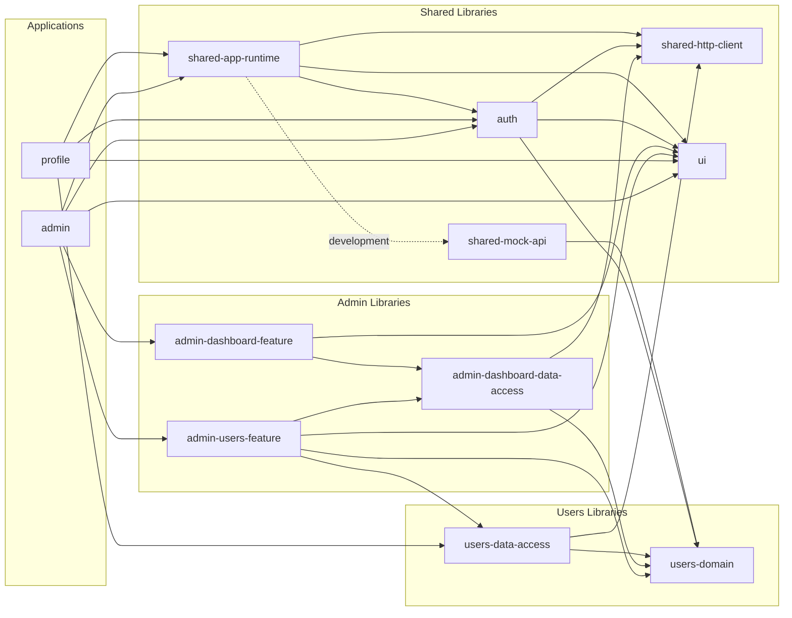
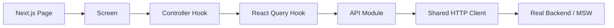

# پلتفرم SaaS — معماری Frontend چندمحصولی

این پروژه یک Frontend چندمحصولی برای یک پلتفرم SaaS است که دو محصول مستقل **Admin** و **Profile** را در یک Monorepo نگه‌داری می‌کند. هدف اصلی پروژه نمایش یک معماری قابل توسعه برای چند محصول و چند تیم است؛ بنابراین تصمیم‌ها بیشتر بر مرزبندی کد، مالکیت Featureها، مدیریت وابستگی‌ها و رفتار قابل پیش‌بینی برنامه متمرکز هستند.

## فهرست مطالب

- [قابلیت‌های پیاده‌سازی‌شده](#قابلیتهای-پیادهسازیشده)
- [اجرای پروژه](#اجرای-پروژه)
- [معماری انتخاب‌شده](#معماری-انتخابشده)
- [ساختار مخزن](#ساختار-مخزن)
- [پروژه‌ها و Libraryهای Nx](#پروژهها-و-libraryهای-nx)
- [گراف وابستگی Nx](#گراف-وابستگی-nx)
- [مرز مسئولیت لایه‌ها](#مرز-مسئولیت-لایهها)
- [تصمیم متفاوت برای Admin و Profile](#تصمیم-متفاوت-برای-admin-و-profile)
- [مدیریت API و Server State](#مدیریت-api-و-server-state)
- [احراز هویت و Protected Routes](#احراز-هویت-و-protected-routes)
- [مدیریت Loading و Error](#مدیریت-loading-و-error)
- [دلیل انتخاب تکنولوژی‌ها](#دلیل-انتخاب-تکنولوژیها)
- [توسعه پروژه با Featureها و تیم‌های جدید](#توسعه-پروژه-با-featureها-و-تیمهای-جدید)
- [کنترل کیفیت](#کنترل-کیفیت)

## قابلیت‌های پیاده‌سازی‌شده

### Admin

- ورود و خروج کاربر
- محافظت از تمام Routeهای مدیریتی و کنترل نقش `admin`
- Dashboard با خلاصه تعداد کاربران و مدیران
- مشاهده فهرست کاربران
- مشاهده جزئیات کاربر
- ساخت، ویرایش و حذف کاربر
- فرم‌های Formik با Validation مبتنی بر Yup
- Sidebar واکنش‌گرا و رابط کاملاً راست‌چین

### Profile

- ورود و خروج کاربر
- محافظت از Route پروفایل
- دریافت و نمایش اطلاعات کاربر واردشده
- رابط کاملاً راست‌چین

### قابلیت‌های مشترک

- احراز هویت و بررسی اعتبار Session
- HTTP Client و قرارداد یکسان برای خطاهای API
- مدیریت Server State با React Query
- Theme، Layout، حالت‌های Loading/Error و زیرساخت RTL
- API Mock با MSW و داده‌ها و پیام‌های فارسی
- جلوگیری از ارسال تکراری عملیات در زمان Loading

## اجرای پروژه

### پیش‌نیاز

- نسخه LTS از Node.js
- npm

### نصب

```bash
npm install
```

فایل‌های Service Worker مربوط به MSW داخل هر دو اپ قرار دارند. اگر این فایل‌ها حذف شدند، می‌توان آن‌ها را دوباره ساخت:

```bash
npx msw init apps/admin/public --save
npx msw init apps/profile/public --save
```

### اجرای اپ‌ها

```bash
# Admin: http://localhost:3000
npm run dev:admin

# Profile: http://localhost:3001
npm run dev:profile
```

### حساب‌های آزمایشی

| کاربرد | ایمیل           | رمز عبور   |
| ------ | --------------- | ---------- |
| مدیر   | `admin@saas.io` | `admin123` |
| کاربر  | `user@saas.io`  | `user123`  |

<p dir="rtl" align="right">
برای ورود به <bdi dir="ltr">Route</bdi>های محافظت‌شده <bdi dir="ltr">Admin</bdi> باید از حساب مدیر استفاده شود.
</p>

<p dir="rtl" align="right">
<bdi dir="ltr">Mock API</bdi> در محیط <bdi dir="ltr">Development</bdi> به‌صورت خودکار فعال است. برای فعال‌کردن صریح آن در محیطی دیگر می‌توان مقدار زیر را تنظیم کرد:
</p>

```bash
NEXT_PUBLIC_ENABLE_MOCKS=true
```

در Production و بدون این متغیر، برنامه درخواست‌ها را به Endpointهای واقعی `/api` ارسال می‌کند.

## معماری انتخاب‌شده

معماری پروژه یک **Modular Monorepo با Feature-based Architecture و مرزبندی لایه‌ای** است.

<ul dir="rtl" align="right">
  <li><strong><bdi dir="ltr">Monorepo</bdi></strong> امکان نگه‌داری چند محصول و کد مشترک آن‌ها را در یک مخزن فراهم می‌کند.</li>
  <li><strong><bdi dir="ltr">Feature-based Architecture</bdi></strong> کد را بر اساس قابلیت‌های کسب‌وکار مانند <bdi dir="ltr">Authentication</bdi>، <bdi dir="ltr">User Management</bdi> و <bdi dir="ltr">Dashboard</bdi> سازماندهی می‌کند.</li>
  <li><strong><bdi dir="ltr">Layered boundaries</bdi></strong> جهت وابستگی میان <bdi dir="ltr">Domain</bdi>، <bdi dir="ltr">Data Access</bdi>، <bdi dir="ltr">Feature</bdi>، <bdi dir="ltr">UI</bdi> و <bdi dir="ltr">App</bdi> را مشخص می‌کند.</li>
  <li>هر <bdi dir="ltr">Next.js App</bdi> یک واحد مستقل برای اجرا، <bdi dir="ltr">Build</bdi> و استقرار است و نقش <bdi dir="ltr">Composition Root</bdi> محصول را دارد.</li>
</ul>

<p dir="rtl" align="right">
این ساختار برای سناریوی تسک مناسب است، چون تیم‌های آینده می‌توانند جداگانه روی هر اپ کار کنند و کد مشترک را در <bdi dir="ltr">Library</bdi>های مشخص با قراردادهای عمومی نگه دارند. تغییر مشترک در <bdi dir="ltr">Auth</bdi>، <bdi dir="ltr">UI</bdi> یا <bdi dir="ltr">API</bdi> می‌تواند در یک تغییر هماهنگ برای هر دو محصول انجام شود؛ به این ترتیب انسجام محصولات حفظ می‌شود و مالکیت کد اختصاصی هر محصول هم روشن می‌ماند. <bdi dir="ltr">Feature</bdi>ها ماژولار هستند و در صورت سازگاری مسئولیت و محدودهٔ وابستگی، از طریق <bdi dir="ltr">Public API</bdi> قابل استفادهٔ مجددند؛ لازم نیست همهٔ آن‌ها بین همهٔ محصولات مشترک باشند. افزودن قابلیت جدید نیز با پیروی از ساختار قابلیت‌های موجود و تعیین محدوده و وابستگی‌های آن ساده‌تر می‌شود.
</p>

<p dir="rtl" align="right">
<bdi dir="ltr">Micro Frontend</bdi> در وضعیت فعلی انتخاب نشده است. در فرض طراحی این تسک، مقیاس تیم هنوز آن‌قدر بزرگ نیست که انتشار و استقرار مستقل بخش‌های یک محصول توسط چند تیم ضروری باشد. همچنین نیازی به ساخت محصول یا بخشی از آن با یک استک دیگر مانند <bdi dir="ltr">Angular</bdi> و ترکیب آن با بخش‌های فعلی در <bdi dir="ltr">Runtime</bdi> مطرح نشده است. بنابراین <bdi dir="ltr">Monorepo</bdi> در کنار ساختار <bdi dir="ltr">Feature-based</bdi> نیاز فعلی را پوشش می‌دهد.
</p>

<p dir="rtl" align="right">
دو <bdi dir="ltr">Next.js App</bdi> همین حالا هم از نظر اجرا، <bdi dir="ltr">Build</bdi> و استقرار مستقل هستند؛ این استقلال به‌تنهایی نیازمند <bdi dir="ltr">Micro Frontend</bdi> نیست. حتی داشتن محصولی مستقل با استک متفاوت نیز به‌تنهایی چنین ضرورتی ایجاد نمی‌کند. اگر در آینده چند تیم به انتشار مستقل بخش‌های یک رابط مشترک و ترکیب آن‌ها در <bdi dir="ltr">Runtime</bdi> نیاز پیدا کنند، این انتخاب بازنگری می‌شود. در شرایط فعلی، هزینهٔ <bdi dir="ltr">Versioning</bdi>، ارتباط بین بخش‌ها، استقرار و <bdi dir="ltr">Debug</bdi> چنین معماری‌ای توجیه ندارد.
</p>

<p dir="rtl" align="right">
برای مثال، اگر در آینده تیم‌های مسئول <bdi dir="ltr">Dashboard</bdi> و مدیریت کاربران نیاز داشته باشند بخش خود را جداگانه <bdi dir="ltr">Build</bdi> و <bdi dir="ltr">Deploy</bdi> کنند، بدون آنکه انتشار آن بخش نیازمند بازسازی و استقرار کل اپ <bdi dir="ltr">Admin</bdi> باشد، و این بخش‌ها همچنان در یک رابط مشترک نمایش داده شوند، <bdi dir="ltr">Micro Frontend</bdi> گزینهٔ قابل بررسی خواهد بود. <bdi dir="ltr">Library</bdi>های فعلی مرز کد و مالکیت تیمی ایجاد می‌کنند، اما واحد استقرار مستقل نیستند. در مقابل، اگر فقط بخواهیم اپ‌های <bdi dir="ltr">Admin</bdi> و <bdi dir="ltr">Profile</bdi> را جداگانه و در زمان‌های متفاوت مستقر کنیم، ساختار فعلی این امکان را دارد و نیازی به تغییر معماری نیست.
</p>

### انتخاب Nx

<p dir="rtl" align="right">
پس از انتخاب معماری <bdi dir="ltr">Monorepo + Modular Feature-based</bdi>، ابزار <bdi dir="ltr">Nx</bdi> برای مدیریت و کنترل این ساختار انتخاب شده است. صرفاً قرار دادن چند اپ در یک مخزن به <bdi dir="ltr">Nx</bdi> نیاز ندارد؛ <a href="https://pnpm.io/workspaces"><bdi dir="ltr">pnpm Workspaces</bdi></a> هم مدیریت پکیج‌های یک مخزن و اتصال وابستگی‌های محلی را فراهم می‌کند. <bdi dir="ltr">pnpm</bdi> مدیر پکیج است و می‌تواند کنار <bdi dir="ltr">Nx</bdi> یا <bdi dir="ltr">Turborepo</bdi> استفاده شود؛ پروژهٔ فعلی از <bdi dir="ltr">npm</bdi> استفاده می‌کند. مقایسهٔ زیر دربارهٔ ابزار مدیریت پروژه‌ها و اجرای کارهاست، نه تعویض مدیر پکیج پروژه.
</p>

<p dir="rtl" align="right">
مزیت تعیین‌کنندهٔ <bdi dir="ltr">Nx</bdi> برای این تسک، تبدیل مرزهای معماری به قوانین قابل بررسی است. در <code dir="ltr">eslint.config.mjs</code>، قانون <code dir="ltr">@nx/enforce-module-boundaries</code> با تگ‌های نوع و محدوده فعال است؛ مثلاً <bdi dir="ltr">Profile</bdi> نمی‌تواند قابلیت اختصاصی <bdi dir="ltr">Admin</bdi> را وارد کند و <bdi dir="ltr">Domain</bdi> به لایه‌های نمایشی وابسته نمی‌شود. این تصمیم بر قابلیت واقعی استفاده‌شده در مخزن تکیه دارد. جزئیات این امکان در <a href="https://nx.dev/docs/guides/enforce-module-boundaries">مستندات مرزبندی Nx</a> آمده است.
</p>

<table dir="rtl" align="right">
  <thead><tr><th>معیار</th><th><bdi dir="ltr">Nx</bdi></th><th><bdi dir="ltr">Turborepo + pnpm</bdi></th></tr></thead>
  <tbody>
    <tr><td>پیچیدگی راه‌اندازی</td><td>در ساختار فعلی بیشتر؛ تعریف پروژه‌ها، تگ‌ها و قواعد</td><td>برای شروع با پکیج‌ها و اسکریپت‌ها معمولاً کمتر</td></tr>
    <tr><td>تولید کد</td><td>✅ تولیدکننده‌های قابل برنامه‌نویسی و توسعه از طریق پلاگین</td><td>✅ تولید کد و پکیج با <code dir="ltr">turbo gen</code> و قالب‌ها</td></tr>
    <tr><td>اعمال مرز ماژول‌ها</td><td>قواعد مبتنی بر تگ در <bdi dir="ltr">ESLint</bdi>؛ استفاده‌شده در همین پروژه</td><td>دارای <code dir="ltr">turbo boundaries</code>؛ دامنه و بلوغ آن باید با قواعد موردنیاز پروژه سنجیده شود</td></tr>
    <tr><td>اکوسیستم پلاگین</td><td>ابزارهای یکپارچه برای تولید کد، اجرای کارها و مهاجرت تنظیمات</td><td>تمرکز بر اجرای اسکریپت‌های پکیج‌ها؛ یکپارچه‌سازی ابزارهای دیگر بیشتر بر عهدهٔ مخزن</td></tr>
    <tr><td>منحنی یادگیری</td><td>در این الگو بیشتر؛ گراف، تگ‌ها و تنظیمات پروژه</td><td>برای تیم آشنا با پکیج‌ها و اسکریپت‌ها معمولاً کمتر</td></tr>
    <tr><td>مقیاس سازمانی</td><td>برای نیاز این تسک به کنترل معماری و رشد چندتیمی مناسب‌تر ارزیابی شده است</td><td>قابل استفاده در مقیاس بزرگ؛ قواعد معماری موردنیاز باید جداگانه ارزیابی و تکمیل شوند</td></tr>
  </tbody>
</table>

<p dir="rtl" align="right">
ارزیابی پیچیدگی و تناسب سازمانی در جدول، قضاوت طراحی این پروژه است، نه رتبه‌بندی مطلق ابزارها. هر دو ابزار امکانات اجرای کارها و کش دارند؛ دلیل ترجیح <bdi dir="ltr">Nx</bdi> فقط سرعت <bdi dir="ltr">Build</bdi> نیست. برای بررسی قابلیت‌ها: <a href="https://21.nx.dev/docs/features">امکانات Nx</a>، <a href="https://turborepo.dev/docs/guides/generating-code">تولید کد Turborepo</a> و <a href="https://turborepo.dev/docs/reference/boundaries">مرزبندی Turborepo</a>. بنابراین نبود تولید کد یا نبود مطلق مرزبندی در <bdi dir="ltr">Turborepo</bdi> مبنای این انتخاب نیست.
</p>

### انتخاب Next.js

<p dir="rtl" align="right">
<bdi dir="ltr">Next.js</bdi> روی <bdi dir="ltr">React</bdi> ساخته شده است و جایگزین آن نیست؛ مقایسهٔ تصمیم این پروژه، استفاده از این فریم‌ورک در برابر ترکیب <bdi dir="ltr">React</bdi> با ابزار ساختی مانند <bdi dir="ltr">Vite</bdi> و یک مسیریاب جداگانه است. انتخاب <bdi dir="ltr">Next.js</bdi> برای داشتن قرارداد یکسان مسیریابی فایل‌محور و <bdi dir="ltr">Layout</bdi>های تو‌در‌تو در هر دو محصول است. ساختار <code dir="ltr">page.tsx</code> و <code dir="ltr">layout.tsx</code> در <a href="https://nextjs.org/docs/14/app/building-your-application/routing/pages-and-layouts">مستندات نسخهٔ ۱۴ Next.js</a> توضیح داده شده است.
</p>

<p dir="rtl" align="right">
در این مخزن، فایل‌های مسیر فقط صفحهٔ مناسب را متصل می‌کنند و <bdi dir="ltr">Layout</bdi> گروه محافظت‌شده محل اتصال محافظ احراز هویت و پوستهٔ محصول است. منطق قابلیت‌ها در <bdi dir="ltr">Feature</bdi>ها باقی می‌ماند؛ در نتیجه تیم‌ها برای اضافه‌کردن مسیر جدید از قرارداد مشخصی پیروی می‌کنند و هر اپ تنظیمات اجرا و <bdi dir="ltr">Build</bdi> خود را دارد. وجود <bdi dir="ltr">Next.js</bdi> به‌خودی‌خود احراز هویت یا مجوز دسترسی ایجاد نمی‌کند؛ این رفتار با کد مشترک <bdi dir="ltr">Auth</bdi> پیاده شده است.
</p>

<p dir="rtl" align="right">
برای صفحات مدیریتی فعلی، <bdi dir="ltr">SEO</bdi> و دریافت داده در سرور دلیل اصلی انتخاب نیستند؛ داده‌های صفحات فعلی با <bdi dir="ltr">React Query</bdi> در سمت کلاینت دریافت می‌شوند. ترکیب <bdi dir="ltr">React + Vite</bdi> هم گزینهٔ معتبری بود و برای یک اپ صرفاً کلاینتی می‌توانست ساده‌تر باشد. در این تسک، یکپارچگی قراردادهای مسیریابی و ساختار دو محصول به هزینهٔ یادگیری و تنظیمات بیشتر فریم‌ورک ترجیح داده شده است.
</p>

## ساختار مخزن

<pre dir="ltr"><code>.
├── apps/
│   ├── admin/
│   │   ├── app/                    # <bdi dir="rtl"><bdi dir="ltr">Next.js routes, layouts, loading</bdi> و <bdi dir="ltr">error boundaries</bdi></bdi>
│   │   │   ├── login/
│   │   │   └── (protected)/
│   │   │       ├── dashboard/
│   │   │       └── users/
│   │   │           ├── new/
│   │   │           └── [id]/edit/
│   │   └── src/app-shell/          # <bdi dir="rtl"><bdi dir="ltr">Navigation</bdi> و تنظیمات <bdi dir="ltr">Shell</bdi> اپ <bdi dir="ltr">Admin</bdi></bdi>
│   │
│   └── profile/
│       ├── app/                    # <bdi dir="rtl"><bdi dir="ltr">Next.js routes</bdi> و <bdi dir="ltr">layouts</bdi></bdi>
│       │   ├── login/
│       │   └── (protected)/profile/
│       └── src/
│           ├── app-shell/          # <bdi dir="rtl">تنظیمات <bdi dir="ltr">Shell</bdi> اپ <bdi dir="ltr">Profile</bdi></bdi>
│           └── features/profile/   # <bdi dir="rtl"><bdi dir="ltr">Feature</bdi> داخلی و اختصاصی <bdi dir="ltr">Profile</bdi></bdi>
│
├── libs/
│   ├── admin/
│   │   ├── dashboard/
│   │   │   ├── feature/            # <bdi dir="ltr"><bdi dir="ltr">Dashboard screen</bdi></bdi>
│   │   │   │   └── src/
│   │   │   │       ├── index.ts
│   │   │   │       └── lib/
│   │   │   │           └── screens/
│   │   │   │               └── dashboard-screen.tsx
│   │   │   └── data-access/        # <bdi dir="rtl"><bdi dir="ltr">Query</bdi>، <bdi dir="ltr">query key</bdi> و <bdi dir="ltr">API</bdi></bdi>
│   │   └── users/feature/          # <bdi dir="rtl"><bdi dir="ltr">Feature</bdi> کامل <bdi dir="ltr">User Management</bdi> در <bdi dir="ltr">Admin</bdi></bdi>
│   │       └── src/
│   │           ├── index.ts
│   │           └── lib/
│   │               ├── screens/    # <bdi dir="rtl">ورودی‌های سطح <bdi dir="ltr">Route</bdi></bdi>
│   │               ├── components/ # <bdi dir="rtl">اجزای نمایشی <bdi dir="ltr">Feature</bdi></bdi>
│   │               ├── hooks/      # <bdi dir="rtl">منطق و <bdi dir="ltr">Controller</bdi>های صفحه</bdi>
│   │               └── validation/ # <bdi dir="rtl"><bdi dir="ltr">Schema</bdi>های <bdi dir="ltr">Yup</bdi></bdi>
│   │
│   ├── users/
│   │   ├── domain/                 # <bdi dir="rtl">مدل‌ها و قراردادهای مستقل از <bdi dir="ltr">Framework</bdi></bdi>
│   │   └── data-access/            # <bdi dir="rtl"><bdi dir="ltr">React Query hooks</bdi> و <bdi dir="ltr">Users API</bdi></bdi>
│   │
│   ├── auth/                       # <bdi dir="rtl"><bdi dir="ltr">Login</bdi>، <bdi dir="ltr">Session</bdi>، <bdi dir="ltr">Logout</bdi> و <bdi dir="ltr">ProtectedRoute</bdi></bdi>
│   ├── ui/                         # <bdi dir="rtl"><bdi dir="ltr">UI</bdi> و <bdi dir="ltr">Layout</bdi> مشترک و مستقل از محصول</bdi>
│   └── shared/
│       ├── app-runtime/            # <bdi dir="rtl"><bdi dir="ltr">Provider</bdi>های سراسری و <bdi dir="ltr">QueryClient</bdi></bdi>
│       ├── http-client/            # <bdi dir="rtl">تنها محل استفاده مستقیم از <bdi dir="ltr">fetch</bdi></bdi>
│       └── mock-api/               # <bdi dir="rtl"><bdi dir="ltr">Handler</bdi>ها و داده‌های <bdi dir="ltr">MSW</bdi></bdi>
│
├── tools/                          # <bdi dir="rtl">تنظیمات مشترک <bdi dir="ltr">alias</bdi> و <bdi dir="ltr">Next.js</bdi></bdi>
├── eslint.config.mjs               # <bdi dir="rtl">قوانین کیفیت و <bdi dir="ltr">Nx boundaries</bdi></bdi>
├── nx.json
├── tsconfig.base.json              # <bdi dir="ltr"><bdi dir="ltr">Public import aliases</bdi></bdi>
└── vitest.config.mjs</code></pre>

## پروژه‌ها و Libraryهای Nx

<p dir="rtl" align="right">
<bdi dir="ltr">Workspace</bdi> در حال حاضر <strong>۱۲ پروژه <bdi dir="ltr">Nx</bdi></strong> دارد: <strong>۲ <bdi dir="ltr">Application</bdi></strong> و <strong>۱۰ <bdi dir="ltr">Library</bdi></strong>.
</p>

| محدوده      |  تعداد | پروژه‌ها                                                                        |
| ----------- | -----: | ------------------------------------------------------------------------------- |
| Application |      ۲ | `admin`, `profile`                                                              |
| Admin       |      ۳ | `admin-users-feature`, `admin-dashboard-feature`, `admin-dashboard-data-access` |
| Users       |      ۲ | `users-domain`, `users-data-access`                                             |
| Shared      |      ۵ | `auth`, `ui`, `shared-app-runtime`, `shared-http-client`, `shared-mock-api`     |
| **مجموع**   | **۱۲** | **۲ App + ۱۰ Library**                                                          |

Libraryها فقط برای اشتراک کد ساخته نشده‌اند. در Admin، بعضی Libraryها مرز مالکیت، نوع وابستگی و واحد مستقل Cache/Affected در Nx نیز هستند. در مقابل، کوچک‌ترین فایل یا Feature به Library تبدیل نشده تا گراف پروژه بی‌دلیل بزرگ و نگه‌داری آن پرهزینه نشود.

## گراف وابستگی Nx

نمودار زیر از خروجی واقعی `nx graph` این Workspace استخراج شده است. جهت فلش از مصرف‌کننده به وابستگی است و خط‌چین وابستگی Dynamic مربوط به بارگذاری MSW را نشان می‌دهد.



برای مشاهده نسخه Interactive گراف:

```bash
npx nx graph
```

وابستگی `admin-users-feature` به `admin-dashboard-data-access` برای باطل‌کردن Cache خلاصه Dashboard پس از حذف کاربر است. اگر تعداد Featureهای Admin زیاد شود، این هماهنگی می‌تواند به یک لایه Invalidation/Event مشترک منتقل شود تا Featureها به یکدیگر وابستگی مستقیم نداشته باشند.

## مرز مسئولیت لایه‌ها

### Apps؛ Composition Root و Routing

پوشه‌های `apps/*/app` فقط مسئول موارد زیر هستند:

- تعریف URL و Route با Next.js App Router
- Layout و Error/Loading boundary سطح Route
- Metadata و Redirect ورودی اپ
- اتصال Route به Screen یا Feature مناسب

کد فرم، Query، مدیریت State و جزئیات UI داخل `page.tsx` قرار نمی‌گیرد. این تصمیم Routeها را کوتاه و قابل فهم نگه می‌دارد، وابستگی کد کسب‌وکار به Next.js را کم می‌کند و جابه‌جایی یا تست Feature را ساده‌تر می‌سازد.

### Screen

Screen ورودی UI یک قابلیت در سطح Route است. وظیفه آن چیدن Componentها و نمایش حالت‌های اصلی صفحه مانند Loading، Error، Empty و Success است. Route فقط Screen را از Public API مربوط به Feature وارد می‌کند.

### Component

Componentهای داخل Feature بخش‌های نمایشی مانند جدول کاربران، فرم، کارت جزئیات و Dialog حذف هستند. ورودی و رخدادها تا حد ممکن با Props دریافت می‌شوند. این تفکیک باعث می‌شود UI خواناتر، قابل استفاده مجدد و مستقل از جزئیات Navigation یا Data Fetching باشد.

### Controller Hook

در Screenهایی که مدیریت Query، Mutation، Router، Toast، Dialog یا جلوگیری از کلیک تکراری پیچیده شده، این منطق به Custom Hook منتقل شده است. برای مثال `useUsersListController` وضعیت فهرست، حذف، Toast، Navigation و Cache invalidation را مدیریت می‌کند و `UsersListScreen` روی نمایش تمرکز دارد.

هدف این نیست که هر Screen بدون توجه به اندازه آن حتماً یک Hook داشته باشد. استخراج منطق زمانی انجام می‌شود که خوانایی، تست‌پذیری یا استفاده مجدد را بهتر کند؛ Screen ساده Profile عمداً مستقیم و کوچک باقی مانده است.

### Data Access و API

Data Access شامل React Query hooks، Query Keyها، Mutationها و API Moduleهای یک Domain است. API Module فقط Endpoint، Method، Payload و نوع پاسخ را می‌شناسد و هیچ تصمیم نمایشی نمی‌گیرد.

این مرزبندی اجازه می‌دهد Backend واقعی، Mock API، سیاست Cache یا کتابخانه انتقال HTTP بدون بازنویسی Screenها تغییر کند.

### Domain

`users-domain` شامل مدل‌های `User`، `UserRole` و ورودی‌های مربوط به کاربر است. این لایه به React، Next.js، MUI یا React Query وابسته نیست. مستقل‌بودن Domain از Framework از انتشار وابستگی‌های UI و Data Fetching به مدل‌های اصلی جلوگیری می‌کند.

### Public API

هر Library یک `src/index.ts` دارد. مصرف‌کننده‌ها از Aliasهایی مانند موارد زیر استفاده می‌کنند:

```ts
import { UsersListScreen } from "@saas/admin/users/feature";
import { useUser } from "@saas/users/data-access";
```

فایل‌های داخلی Feature مستقیماً Deep Import نمی‌شوند. Public API سطح قابل پشتیبانی Library را مشخص می‌کند، Refactor داخلی را کم‌هزینه‌تر می‌سازد و از وابستگی به جزئیات پیاده‌سازی جلوگیری می‌کند.

## تصمیم متفاوت برای Admin و Profile

اندازه، نرخ رشد و مدل مالکیت دو محصول یکسان فرض نشده است؛ به همین دلیل Granularity پروژه‌های Nx در آن‌ها عمداً متفاوت است.

### Profile

Profile فعلاً یک قابلیت کوچک و منسجم دارد و فرض شده در آینده یک تیم مالک کل این محصول باشد. Feature پروفایل در مسیر زیر قرار گرفته است:

```text
apps/profile/src/features/profile/profile-screen.tsx
```

تبدیل این Feature کوچک به یک Nx Library مستقل، در حال حاضر مزیت مرزبندی تیمی قابل توجهی ایجاد نمی‌کند و فقط Node، تنظیمات و مسیر دیگری به Project Graph اضافه می‌کند. نزدیک‌بودن Feature به اپ، پیدا کردن کد و تغییرات یک تیم واحد را ساده نگه می‌دارد.

### Admin

<p dir="rtl" align="right">
محصول <bdi dir="ltr">Admin</bdi> بزرگ‌تر و دارای قابلیت‌های بیشتری فرض شده و احتمال دارد در آینده چند تیم به‌صورت هم‌زمان روی <bdi dir="ltr">User Management</bdi>، <bdi dir="ltr">Dashboard</bdi> و قابلیت‌های جدید کار کنند. این فرض دربارهٔ رشد کل محصول است؛ صفحهٔ فعلی <bdi dir="ltr">Dashboard</bdi> به‌خودی‌خود بزرگ یا پیچیده نیست. به همین دلیل قابلیت‌های <bdi dir="ltr">Admin</bdi> در <bdi dir="ltr">libs/admin</bdi> مرز مستقل دارند، در حالی که قابلیت کوچک <bdi dir="ltr">Profile</bdi> داخل اپ خودش باقی مانده است. تبدیل قابلیت‌های <bdi dir="ltr">Admin</bdi> به <bdi dir="ltr">Library</bdi>های <bdi dir="ltr">Nx</bdi> کمک می‌کند تا:
</p>

- مرز مالکیت هر Feature روشن باشد؛
- وابستگی‌های غیرمجاز با Tag و ESLint متوقف شوند؛
- Nx بتواند تغییرات اثرپذیر را دقیق‌تر تشخیص دهد؛
- Cache و اجرای Taskها با Granularity مناسب انجام شود؛
- تیم‌ها بتوانند Featureها را با Public API مستقل توسعه دهند.

این تفاوت یک استثنای تصادفی نیست؛ سطح جداسازی بر اساس هزینه واقعی هماهنگی تیم‌ها انتخاب شده است. اگر Profile در آینده چند Feature مستقل یا چند تیم مالک پیدا کند، می‌توان ساختار آن را بدون تغییر Routeهای بیرونی به شکل `libs/profile/<feature>` توسعه داد.

### دلیل قرارگیری Users در libs

<p dir="rtl" align="right">
قرارگیری <bdi dir="ltr">users</bdi> در <code dir="ltr">libs/users</code> به استفادهٔ مشترک از مدل‌ها و دسترسی به دادهٔ کاربران مربوط است. رابط مدیریت کاربران مخصوص <bdi dir="ltr">Admin</bdi> در <code dir="ltr">libs/admin/users/feature</code> قرار دارد، اما قراردادهای دامنه در <code dir="ltr">libs/users/domain</code> و منطق دسترسی به داده در <code dir="ltr">libs/users/data-access</code> نگه‌داری می‌شوند. هم صفحات مدیریت کاربران و هم صفحهٔ <bdi dir="ltr">Profile</bdi> از این لایهٔ داده استفاده می‌کنند؛ برای نمونه هر دو برای دریافت جزئیات کاربر از <code dir="ltr">useUser</code> استفاده می‌کنند.
</p>

<p dir="rtl" align="right">
این جداسازی برای سناریوی چندمحصولی تسک مناسب است: قراردادهای کاربر، درخواست‌های <bdi dir="ltr">API</bdi> و کلیدهای <bdi dir="ltr">Query</bdi> تکرار نمی‌شوند و <bdi dir="ltr">Profile</bdi> برای دسترسی به دادهٔ کاربر به قابلیت اختصاصی <bdi dir="ltr">Admin</bdi> وابسته نمی‌شود. در مقابل، داده‌های خلاصهٔ <bdi dir="ltr">Dashboard</bdi> مخصوص <bdi dir="ltr">Admin</bdi> هستند؛ بنابراین <code dir="ltr">libs/admin/dashboard/data-access</code> کنار قابلیت آن قرار گرفته است. معیار محل قرارگیری کد، مصرف‌کننده‌ها و مسئولیت آن است؛ یکسان‌بودن ظاهری همهٔ پوشه‌ها هدف نیست.
</p>

## مدیریت API و Server State

تمام عملیات Server State از یک مسیر ثابت عبور می‌کنند:



React Query و `fetch` نقش یکسان ندارند. React Query چرخه Server State شامل Cache، Loading، Error، Retry، Cancellation و Invalidation را مدیریت می‌کند. `fetch` ابزار انتقال HTTP است و فقط داخل `shared-http-client` استفاده می‌شود.

HTTP Client مشترک وظایف زیر را متمرکز می‌کند:

- Serialize کردن JSON و تنظیم Headerها
- Parse کردن پاسخ
- تبدیل پاسخ ناموفق به `HttpError` دارای Status و Body
- فراهم‌کردن متدهای یکسان `get`, `post`, `put`, `patch`, `delete`

ESLint استفاده مستقیم از `fetch` را در `apps` و سایر `libs` ممنوع می‌کند تا این قرارداد در طول زمان شکسته نشود.

برای Queryهای خواندنی، `AbortSignal` به HTTP Client منتقل می‌شود؛ بنابراین React Query می‌تواند Request بلااستفاده را لغو کند. پس از Mutation نیز Queryهای مرتبط Invalid می‌شوند تا UI با داده سرور همگام بماند.

## احراز هویت و Protected Routes

Authentication در Library مشترک `auth` قرار دارد، چون هر دو محصول به Login، Logout، بازیابی Session و محافظت Route نیاز دارند.

- Zustand فقط وضعیت Client شامل User، Token و Hydration را نگه می‌دارد.
- React Query اعتبار Session را از `/api/auth/me` بررسی می‌کند.
- `AuthProvider` وضعیت Persistشده و Session سمت سرور را هماهنگ می‌کند.
- Login و Logout به‌صورت Mutation پیاده شده‌اند.
- هنگام تغییر حساب یا Logout، Queryهای فعال لغو و Cache پاک می‌شود تا داده کاربر قبلی به کاربر بعدی نشت نکند.
- پاسخ `401` یا `403` Session را نامعتبر می‌کند؛ خطای موقت شبکه به‌عنوان Logout تفسیر نمی‌شود و امکان Retry دارد.

`ProtectedRoute` در Layout گروه `(protected)` هر اپ قرار گرفته است. در نتیجه لازم نیست هر Page دوباره Guard را تعریف کند و هیچ Route جدیدی در این گروه به‌صورت اتفاقی بدون محافظ باقی نمی‌ماند. Admin علاوه بر ورود معتبر، نقش `admin` را نیز کنترل می‌کند.

Mock فعلی Token را در Storage مرورگر نگه می‌دارد. در Backend واقعی، استفاده از Cookie امن `HttpOnly` می‌تواند خطر دسترسی JavaScript به Token را کاهش دهد و باید همراه سیاست CSRF مناسب طراحی شود.

## مدیریت Loading و Error

Loading و Error بخشی از قرارداد هر عملیات Async در نظر گرفته شده‌اند:

- بارگذاری اولیه صفحه با `PageLoading` نمایش داده می‌شود.
- خطای Query با `PageError` و امکان Retry نمایش داده می‌شود.
- Loading مربوط به بازیابی Session قبل از نمایش Route محافظت‌شده کل صفحه را می‌پوشاند.
- دکمه‌های Login، Logout، Create، Edit و Delete هنگام Mutation وضعیت Loading دارند و غیرفعال می‌شوند.
- در عملیات حساس به کلیک تکراری، علاوه بر `isPending` از Lock هم استفاده شده تا فاصله کوتاه قبل از Render بعدی باعث ارسال Request دوم نشود.
- موفقیت و خطای Mutationها با Toast فارسی اعلام می‌شود.
- شکست راه‌اندازی Mock API به‌جای صفحه خالی با پیام مشخص نمایش داده می‌شود.

سیاست عمومی React Query در `shared-app-runtime` متمرکز است: خطاهای `4xx` دوباره امتحان نمی‌شوند، خطاهای موقت Query حداکثر یک بار Retry می‌شوند و Mutationها Retry خودکار ندارند تا عملیات تغییردهنده ناخواسته تکرار نشوند.

## دلیل انتخاب تکنولوژی‌ها

| تکنولوژی                       | مسئولیت                         | دلیل انتخاب                                                                                                     |
| ------------------------------ | ------------------------------- | --------------------------------------------------------------------------------------------------------------- |
| **Nx**                         | مدیریت Monorepo و Project Graph | نمایش و کنترل وابستگی‌ها، Tag-based boundaries، Cache، اجرای Taskها و امکان استفاده از `affected` با رشد تیم‌ها |
| **Next.js App Router**         | Routing و Layout هر محصول       | Routeهای فایل‌محور، Layoutهای تو‌در‌تو، Loading/Error boundary و حفظ استقلال Build هر محصول                     |
| **React + TypeScript Strict**  | UI و Type Safety                | قرارداد روشن میان Domain، API و Componentها و کشف خطاهای Refactor پیش از Runtime                                |
| **TanStack React Query**       | Server State                    | Cache، Deduplication، Retry، Cancellation، Mutation و Invalidation استاندارد در هر دو اپ                        |
| **Fetch + Shared HTTP Client** | انتقال HTTP                     | استفاده از API استاندارد مرورگر بدون وابستگی اضافی و حفظ یک نقطه مشترک برای Parse و Error normalization         |
| **Zustand**                    | Client State احراز هویت         | API کوچک و مناسب برای User، Token و Hydration؛ داده سرور در React Query تکرار نمی‌شود                           |
| **Material UI**                | Design system و Componentها     | سرعت توسعه مطابق پیشنهاد تسک، دسترس‌پذیری پایه، Theme مشترک و پشتیبانی مناسب از Layout واکنش‌گرا                |
| **Emotion + Stylis RTL**       | استایل راست‌چین                 | اعمال RTL واقعی به Styleهای تولیدشده MUI در کنار `dir="rtl"`                                                    |
| **Formik**                     | مدیریت فرم                      | مدیریت Field، Submit و Error state فرم‌های ساخت و ویرایش کاربر                                                  |
| **Yup**                        | Validation                      | Schema قابل استفاده مجدد و جدا از JSX برای Validation فرم                                                       |
| **MSW**                        | Mock API                        | شبیه‌سازی API در سطح شبکه؛ Featureها همان Request واقعی را می‌فرستند و به Mock بودن Backend وابسته نمی‌شوند     |
| **react-hot-toast**            | بازخورد عملیات                  | نمایش یکسان Loading، Success و Error برای Mutationها بدون افزودن State نمایشی تکراری                            |
| **Vitest**                     | تست واحد                        | اجرای سریع تست قرارداد API، Query Key، سیاست Retry و Validation                                                 |
| **ESLint + Prettier**          | کیفیت و یکپارچگی کد             | اجرای خودکار قواعد مرزی Nx، جلوگیری از `fetch` مستقیم و یکسان‌سازی قالب کد                                      |

### چرا Nx؟

نیاز اصلی این سناریو فقط قرار دادن چند پوشه در یک Repository نیست. با افزایش محصولات و تیم‌ها باید بتوان فهمید چه پروژه‌ای به کدام بخش وابسته است، چه تغییری چه Build/Testهایی را متاثر می‌کند و آیا یک تیم مرز محصول دیگر را شکسته است. Nx این اطلاعات را از Importهای واقعی استخراج می‌کند و آن‌ها را برای Graph، Cache و `affected` به کار می‌گیرد.

Projectها با دو گروه Tag کنترل می‌شوند:

- Tagهای نوع: `type:app`, `type:app-shell`, `type:feature`, `type:data-access`, `type:domain`, `type:ui`
- Tagهای محدوده: `scope:admin`, `scope:profile`, `scope:users`, `scope:shared`

برای مثال Admin اجازه وابستگی به محدوده‌های `admin`، `users` و `shared` را دارد؛ Profile نمی‌تواند Feature اختصاصی Admin را Import کند. همچنین Domain فقط می‌تواند به Domain وابسته شود. این قوانین با `@nx/enforce-module-boundaries` در ESLint بررسی می‌شوند و صرفاً یک توافق شفاهی میان تیم‌ها نیستند.

## توسعه پروژه با Featureها و تیم‌های جدید

### افزودن Feature بزرگ به Admin

برای Feature مستقلی مانند Billing که تیم یا چرخه توسعه جدا دارد:

```text
libs/admin/billing/
├── feature/
│   ├── project.json
│   └── src/
│       ├── screens/
│       ├── components/
│       ├── hooks/
│       └── index.ts
└── data-access/
    ├── project.json
    └── src/
        ├── billing.api.ts
        ├── billing.keys.ts
        ├── billing.queries.ts
        └── index.ts
```

Route مربوط به آن فقط Screen را در `apps/admin/app/(protected)` Compose می‌کند. Tagهای `scope:admin` و نوع مناسب نیز باید به Projectها افزوده شوند.

### افزودن Feature کوچک به Profile

تا زمانی که Featureها توسط یک تیم و در یک چرخه Release نگه‌داری می‌شوند:

```text
apps/profile/src/features/<feature-name>/
```

اگر تعداد تیم‌ها، اندازه کد یا نیاز به مرز مستقل افزایش یافت، Feature به `libs/profile/<feature-name>` منتقل و Tagهای Nx برای آن تعریف می‌شود. معیار استخراج، مالکیت و هزینه هماهنگی است، نه صرفاً تعداد فایل‌ها.

### افزودن محصول جدید

1. یک Next.js App جدید در `apps/<product>` ساخته می‌شود.
2. Scope جدید مانند `scope:billing` تعریف می‌شود.
3. قوانین مجاز وابستگی آن Scope به ESLint اضافه می‌شود.
4. `AppProviders`، Auth و UI مشترک در Root Layout Compose می‌شوند.
5. فقط قابلیت‌های واقعاً مشترک از `libs` مصرف می‌شوند و Featureهای اختصاصی در Scope محصول باقی می‌مانند.

## کنترل کیفیت

```bash
# TypeScript هر دو اپ
npm run typecheck

# ESLint و Nx module boundaries
npm run lint

# تست‌های واحد
npm test

# کنترل قالب کد
npm run format:check

# Build مستقل محصولات
npm run build:admin
npm run build:profile
```

تست‌های فعلی قرارداد HTTP Client و API، Header احراز هویت، Query Keyها، سیاست Retry Session و Schemaهای Validation را پوشش می‌دهند. Build مستقل هر دو اپ نیز تضمین می‌کند مرزهای بسته‌بندی و Aliasهای Libraryها در Production قابل Resolve هستند.

## جمع‌بندی تصمیم معماری

ساختار پروژه تلاش می‌کند بین دو هزینه تعادل برقرار کند: جلوگیری از درهم‌تنیدگی چند محصول و پرهیز از تبدیل هر بخش کوچک به یک Library مستقل. کد مشترک و Featureهای بزرگ Admin مرز Nx دارند؛ Feature کوچک و تک‌تیمی Profile نزدیک اپ باقی مانده است. با این مدل، ساختار امروز ساده می‌ماند و مسیر رشد به چند محصول، چند Feature و چند تیم نیز از قبل مشخص و قابل اعمال است.
